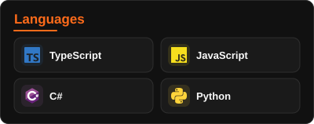
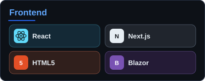
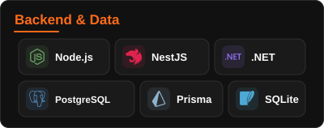
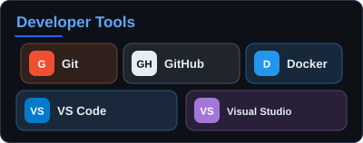
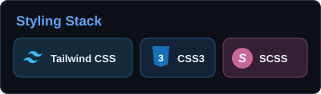

<!-- GitHub Profile | github.com/ygttncy -->

<h1>
  
  Hi, I'm Yiğit
</h1>

<strong>Full Stack Developer</strong>

Building thoughtful software for real-world business needs.

  
  

 

<h2>
  
  About me
</h2>

I’m a full stack developer who enjoys turning complicated workflows into simple, reliable software. My work focuses on SaaS products, business management systems, and automation.

Currently, I’m building Viorasoft and exploring how modern web technologies, .NET, and AI can improve everyday business operations.

 

<h2>
  
  Tech stack
</h2>

  
  

   

  
  

   

  

   

  Also working with Firebase.

 

<h2>
  
  Selected projects
</h2>

Viorasoft 

A business-focused SaaS platform with product management, subscriptions, support workflows, and role-based administration. Also developing a Blazor / .NET interface.

Next.js · TypeScript · Tailwind CSS · NestJS · PostgreSQL · Prisma · Blazor

Inventory & Business Management

Software for stock tracking, sales workflows, and operational reporting, designed around the needs of everyday businesses.

Python · SQLite · Business Automation

AI-Assisted Business Tools 

Exploring tools for business discovery, website analysis, and tailored service proposals.

AI Integrations · Web Analysis · Automation

 

<h2>
  
  GitHub statistics
</h2>

  
  

 

────────

  
  <strong>Connect</strong>
    
  

